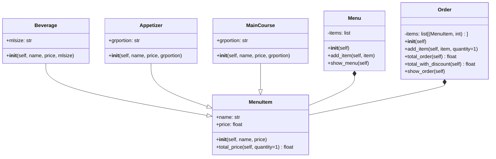

# Reto_3 Composition vs inheritance
## Exercise in Class
Well... My english it's not the best, i will try to explain this challenge in english, let's see what happend...
1. Create class Line.
	```mermaid
	classDiagram
    class Line {
      +float length
      +float slope
      +Point start
      +Point end
      +__init__(self, start, end)
      +compute_length()
      +compute_slope()
      +compute_horizontal_cross()
      +compute_vertical_cross()
    }

	```
- _length_, _slope_, start, end: Instance attributes, two of them being points (so a line is composed at least of two points).
- compute_length(): should return the line´s length
- compute_slope(): should return the slope of the line from tje horizontal in deg.
- compute_horizontal_cross(): should return if exists the intersection with x-axis
- compute_vertical_cross(): should return if exists the intersection with y-axis

2. Redefine the class Rectangle, adding a new method of initialization using 4 Lines (composition at its best, a rectangle is compose of 4 lines).
    
3. **Optional:** Define a method called discretize_line() that creates an array on _n_ equally spaced points in the line and assigned as a instance attribute.

## 1. Lines (Composition of Points)
The most difficult part of this exercise is think about how many cases you in each problem, for example.
### For Slope
We can't divide by 0, in other words, we need to skip the case when $x_1 - x_2 = 0$, this case will became important in the future, because we can use for search a line that never changes in y, by definition: $x = c$.
### For length
Well... in this case there are not so much problems, so we can skip.
### When y = 0 (Cross x)
In some words, let's say there are 4 cases.
- **It cross the x axis:** 
    - it happens when the slope is equal a constant 
    $m = c$
    - Also when the slope is equal to 0, and the intersection with y is equal to 0 (infinity points): $$m = 0,\quad \text{and} \quad b =0$$
    - When the slope tends to infinity, it happens when we don't have a change in x, here we got a cross in $x_2 = c$
    $$x_2-x_1 =0 \rightarrow \lim_{m\rightarrow \infty}$$
    - When the intersection with b is different from 0, and also the slope is 0, never touches x axis.
    $$b\neq 0 \quad \text{and} \quad m = 0$$
### When x = 0 (Cross y)

In some words, let's say there are 3 cases.

- **It crosses the y axis:**
    - it happens when the line has a valid slope and we can compute the intersection:
    $$x = 0 \Rightarrow y = m(0) + b = b$$

    - Also when the slope is equal to 0, and the intersection with y is equal to 0:
    $$m = 0,\quad \text{and} \quad b = c$$

    - When the slope tends to infinity, it happens when there is no change in x:
    $$x_2 - x_1 = 0 \rightarrow m \rightarrow \infty$$
    In this case, the line is vertical and it crosses the y-axis at a single point depending on the value of x, for example if $ infinity points.

- **It does NOT cross the y axis:**
    - when the line is horizontal and not at y = 0:
    $$m = 0,\quad \text{and} \quad b \neq 0$$
## 2. Rectangle using 4 Lines

We need to redefine the class Rectangle.

Now a rectangle is not made with width and height.

A rectangle is made with 4 Line objects (composition).

So the rectangle is composed by:

line1
line2
line3
line4

Each line must connect with the next one and form a closed shape.
## 3. Optional: discretize_line()

We can create a method called discretize_line().

This method:

receives a number n,creates n equally spaced points in the line stores them in a list, assigns the list as an attribute of the class, in this case is so usual use a "interpolation" so basic alghoritm that uses a division from the range that we are working, it would be like.
$$size_{step} = \dfrac{actual_{step}}{n} \quad \text{n is the number of points that we want in the line}$$
# Restaurant Simple

## Short summary
Minimal OOP model for a restaurant:

- `MenuItem` (base class)
- 3 subclasses of MenuItem
- `Menu` container
- `Order` that stores (item, quantity) and calculates totals

---

## What each class does

### MenuItem
- Attributes:
  - name
  - price
- Method:
  - total_price(quantity)

---

### Beverage / Appetizer / MainCourse
- Inherit from `MenuItem`
- Add one extra attribute:
  - Beverage → mlsize
  - Appetizer → grportion
  - MainCourse → grportion

---

### Menu
- Stores all menu items
- Shows available items

---

### Order
- Stores items with quantities
- Calculates subtotal
- Applies discount based on number of items
- Shows final bill

---

## Discount rule

- fewer than 4 items → 0% discount  
- 4 to 5 items → 10% discount  
- 6 or more items → 20% discount  

---

## Example items

### Beverages
- Coca Cola personal  
- Beer can  
- Jugo natural  
- Soda  
- Agua  

### Appetizers
- Sopa de pasta  
- Caldo de costilla  
- Empanada de carne  
- Arepa  

### Main courses
- Crepe de pollo  
- Carne a la parrilla  
- Porción de pizza  
- Hot dog  
- Bandeja Paisa  

---

## Usage (one line flow)

Build menu → create Order → add items with quantities → call `order.show_order()` to print subtotal and final total with discount.
# Restaurant
